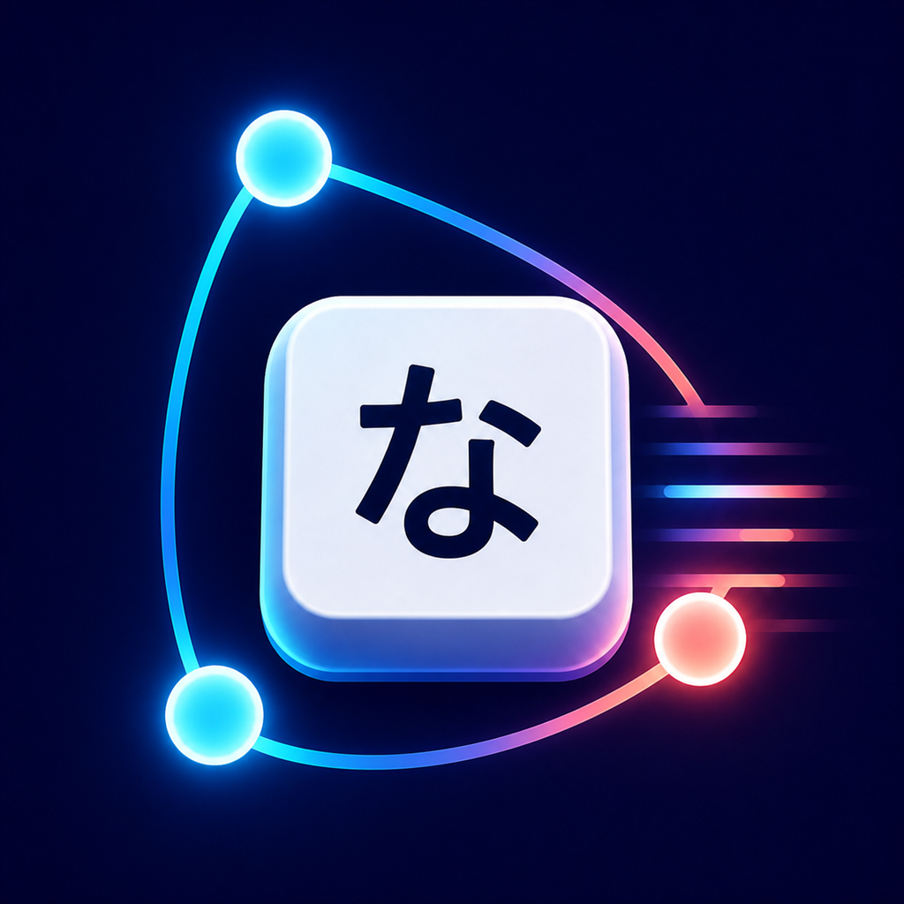

# Keynako



Keynakoは、Swift製の日本語キーボードアプリazooKeyをベースに、FlutterでiOSとAndroidへ移植したマルチプラットフォーム版です。設定アプリの画面とデータモデルはDartで共有し、OSが要求するキーボード拡張部分だけを各プラットフォームのネイティブAPIで実装しています。

## 主な機能

- フリック入力、ローマ字入力、英語・数字・記号・絵文字・顔文字入力
- 変換候補、ライブ変換、学習、ユーザー辞書、テンプレート
- ライト／ダークテーマ、配色・好きな背景画像、azooKey互換カスタムキー、Custardカスタムタブ
- 片手モード、カーソル移動、クリップボード履歴、音・触覚設定
- 設定のJSONバックアップ／復元、連絡先からの辞書登録
- URL（custard.azookey.com、GitHub、Gist、直接JSON）からのCustard 1.0〜1.2インポート
- 元のazooKeyと同じGoogle Forms送信先を使う変換報告・単語共有
- azooKey公式の共有変換辞書を同じGitHub Releasesプロトコルで24時間ごとに同期
- Zenzai v3.2 small／xsmallによる完全オフライン変換

Zenzaiモデルはリポジトリに同梱されています。AndroidはazooKey forkの`llama.cpp`をJNIから呼び出し、iOSは固定リビジョンの`AzooKeyKanaKanjiConverter`を`ZenzaiCPU` trait付きで利用します。モデルの出所とハッシュは[assets/ZENZAI_MODELS.md](assets/ZENZAI_MODELS.md)にあります。

## 構成

| 領域 | 実装 |
| --- | --- |
| 共通アプリ、設定、辞書、テーマ | Flutter / Dart |
| Androidシステムキーボード | `InputMethodService` + Kotlin/JNI |
| iOSシステムキーボード | `UIInputViewController` + Swift |
| Android Zenzai | llama.cpp + C++ JNI bridge |
| iOSかな漢字変換／Zenzai | AzooKeyKanaKanjiConverter Swift Package |

Android/iOSは通常のFlutter画面だけではシステムIMEとして登録できないため、ライフサイクル、入力接続、ネイティブ推論境界には最小限のKotlin、Swift、C++が必要です。共有するアプリロジックとUIはDartに集約しています。互換性維持のため、内部のMethodChannel名、保存キー、App Groupには一部`azooKey`名が残っています。

## 開発環境

- Flutter stable（Dart 3.13以上）
- JDK 17
- Android SDK、NDK 28、CMake 3.22.1（Android）
- macOS、Xcode、Apple Developerの署名設定（iOS）

サブモジュールを含めて取得してください。

```sh
git clone --recursive git@github.com:StupidGame/Keynako.git
cd Keynako
flutter pub get
flutter analyze
flutter test
```

既にclone済みの場合は、次を実行します。

```sh
git submodule update --init --recursive
```

### Android

```sh
flutter build apk --debug
flutter run
```

インストール後、Androidの「システム > キーボード > 画面キーボード」でKeynakoを有効化して選択します。release署名は`KEYNAKO_KEYSTORE_PATH`、`KEYNAKO_STORE_PASSWORD`、`KEYNAKO_KEY_ALIAS`、`KEYNAKO_KEY_PASSWORD`の環境変数から読み込みます。

### iOS

iOS 17以上を対象にしています。macOSで`ios/Runner.xcworkspace`をXcodeから開き、RunnerとAzooKeyKeyboardの両ターゲットに同じDevelopment Teamを設定してください。両ターゲットでApp Groupを有効にし、環境に合わせてbundle identifierと`group.com.azooKey.keyboard`をプロビジョニングします。その後Runnerをビルドし、iOSの「設定 > 一般 > キーボード > キーボード」からKeynakoを追加します。

WindowsではiOS SDKとXcodeが利用できないため、このリポジトリではXcodeプロジェクト、plist、entitlements、Swift Package参照までを構成し、最終署名ビルドはmacOS上で行います。

### GitHub Actions

「Build app files」ワークフローは、Secretsを登録せずに、一時署名されたAndroid APK、未署名iOS IPA、Simulator用アプリを作成します。実行方法と署名上の制約は[docs/github_actions_builds.md](docs/github_actions_builds.md)を参照してください。

## azooKey / Custard互換性

「拡張」の読み込みボタンへCustard URLを入力すると、元のazooKeyと同じJSON形式を単体・配列のどちらでも読み込めます。`https://custard.azookey.com/tab/...` は公式API URLへ自動変換されます。キー座標とサイズ、system key、複数アクション、長押し開始・反復、フリック／PCバリエーションは定義を無損失で保持し、AndroidとiOSのネイティブキーボードが直接実行します。

共有を選んだユーザ辞書語はazooKeyと同じGoogle Formへ申請されます。承認済みの共有語は`azooKey/azooKey_hotfix_dictionary_storage`の最新Releaseと`data_v1.json`をazooKey本体と同じ手順で確認し、同じ24時間間隔・保存キー・`active`／`disabled`処理でAndroid/iOSの変換辞書へ反映します。設定の「azooKey共有変換辞書」から手動更新もできます。

組み込みフリック配列は元の5列×4段構成で、`☆123`、`ABC`、`あいう`、`小ﾞﾟ`、`､｡?!`をカスタムキー編集画面から個別に差し替えられます。

「着せ替えを作成／編集」の背景画像から端末内の画像を選ぶと、最大2048px・8MB以下に調整したコピーをアプリ専用領域へ保存し、AndroidとiOSのキーボード背景へ反映します。画像ファイルは端末内だけに保存され、テーマJSONの共有対象には含まれません。

## ライセンス

本体はリポジトリ既定の[Apache License 2.0](LICENSE)です。移植元、変換エンジン、モデルなどの詳細は[THIRD_PARTY_NOTICES.md](THIRD_PARTY_NOTICES.md)を参照してください。
